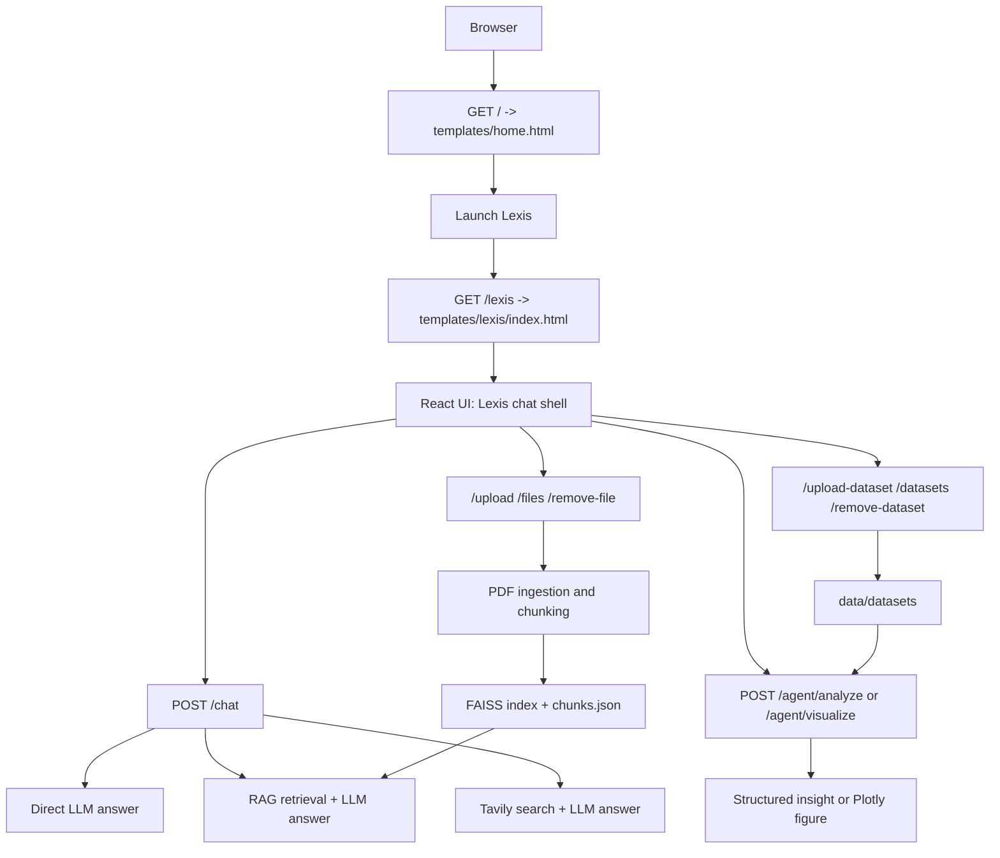

# Nexus + Lexis

Lexis is the live chatbot application inside the Nexus AI Intelligence Platform. Nexus serves the platform homepage at `/`, and Lexis runs at `/lexis` as a conversational workspace for direct LLM chat, document-grounded RAG, web search, dataset analysis, and data visualization.

The project is a Flask backend with a no-build React 18 frontend loaded from Jinja templates. Backend capabilities are split into service modules for RAG, generation, search, and agent execution, so new workflows can be added without turning `app.py` into the whole application.

## Current Capabilities

- Nexus landing page at `/` with Lexis as the featured live application.
- Lexis chatbot at `/lexis` with persistent browser sessions through `localStorage`.
- Direct LLM chat through Groq-backed LangChain chat models.
- Runtime model switching between configured Groq models.
- PDF upload, chunking, FAISS indexing, and hybrid retrieval.
- RAG answers with source metadata, page numbers, hybrid scores, and rerank scores.
- Web search mode through Tavily.
- Dataset upload and management for CSV, XLSX, and XLS files.
- Agentic slash commands for dataset analysis and chart generation.
- Plotly chart rendering in the Lexis UI.
- Backend summarization agent for PDF and tabular files.

## Application Flow



## Runtime Routes

| Route | Method | Purpose |
| --- | --- | --- |
| `/` | GET | Nexus platform homepage. |
| `/lexis` | GET | Lexis chatbot UI. |
| `/model` | GET | Return the currently selected generation model. |
| `/model` | POST | Switch the Groq model used by `AnswerGenerator`. |
| `/chat` | POST | Main chat endpoint for direct, RAG, and web-search responses. |
| `/files` | GET | List uploaded PDF knowledge-base files. |
| `/upload` | POST | Upload a PDF and rebuild the FAISS knowledge base. |
| `/remove-file` | POST | Delete a PDF and rebuild or clear the FAISS index. |
| `/datasets` | GET | List uploaded CSV/Excel datasets for agents. |
| `/upload-dataset` | POST | Save a CSV/Excel file for agent workflows. |
| `/remove-dataset` | POST | Delete a dataset file. |
| `/agent/analyze` | POST | Run the data analysis agent on a selected dataset. |
| `/agent/visualize` | POST | Run the visualization agent and return a Plotly figure. |
| `/agent/summarize` | POST | Run the summarization agent for PDF or tabular files. |

## Chat Execution

The Lexis frontend sends normal messages to `/chat` with this payload shape:

```json
{
  "message": "User question",
  "rag": true,
  "web_search": false,
  "agent_mode": false,
  "agent": null
}
```

`app.py` then chooses one of three paths:

1. **Web search path**: if `web_search` is enabled and `rag` is disabled, `TavilySearch.search()` fetches the top web result, then `AnswerGenerator.generate_web()` rewrites that context into a concise answer.
2. **RAG path**: if `rag` is enabled, `retrieve_docs()` loads the FAISS index and chunk store, combines semantic similarity with BM25 keyword scoring, reranks candidates with a CrossEncoder, and sends the final context to `AnswerGenerator.generate_rag()`.
3. **Direct path**: if neither mode is active, `AnswerGenerator.generate_direct()` answers without retrieval context.

The response always returns a `response` string and a `sources` array. RAG responses also include `context_used` for debugging or inspection.

## RAG Flow

PDF files uploaded through `/upload` are stored in `data/uploads`. `services.ingestion.process_pdf()` loads pages with `PyPDFLoader`, splits text with `RecursiveCharacterTextSplitter`, writes chunk records to `data/vectordb/chunks.json`, and rebuilds the FAISS index in `data/vectordb`.

When a RAG query arrives, `services.retrieval.retrieve_docs()`:

1. Expands the query for known project-specific aliases.
2. Loads FAISS plus `chunks.json`.
3. Runs semantic vector search.
4. Builds an in-memory BM25 index for keyword scoring.
5. Normalizes and combines semantic and keyword scores.
6. Reranks the candidate pool with `cross-encoder/ms-marco-MiniLM-L-6-v2`.
7. Returns the top documents with metadata for source chips in the UI.

## Agentic Flow

Lexis exposes agent mode in the chat input. Typing `/` opens an autocomplete list of agents. The currently wired frontend dispatch is:

- `/create-visualization-agent`: requires a selected CSV/Excel dataset, calls `/agent/visualize`, and renders the returned Plotly figure.
- `/data-analysis-agent`: requires a selected CSV/Excel dataset, calls `/agent/analyze`, and renders a structured analysis card with headline, findings, recommendation, operation status, and a primary table.
- Other slash agents currently fall back through the normal `/chat` path unless explicitly wired in the frontend.

The backend also includes `/agent/summarize`, powered by `agents/Summarization_agent.py`. It supports PDF summaries from the RAG upload folder and CSV/Excel summaries from the dataset folder.

### Data Analysis Agent

`agents/data_analysis_agent.py` uses a two-pass LLM workflow with deterministic pandas execution:

1. Build a schema summary from the selected dataset.
2. Ask the LLM for a JSON analysis plan.
3. Execute only whitelisted pandas operations such as grouping, ranking, distributions, outliers, and correlations.
4. Send computed results back to the LLM for interpretation.
5. Return structured JSON for the React analysis card.

No arbitrary LLM-generated Python is executed.

### Visualization Agent

`agents/data_visualization_agent.py` uses a similar safe plan-and-execute design:

1. Load and normalize the selected dataset.
2. Ask the LLM for a JSON transform and chart plan.
3. Validate all transform steps and chart columns against the actual DataFrame.
4. Execute whitelisted transforms.
5. Build a Plotly figure dictionary.
6. Generate a short natural-language chart summary.

The frontend renders the returned figure with Plotly.js.

## Project Structure

```text
.
|-- app.py                         # Flask app factory, routes, and request dispatch
|-- config/
|   `-- settings.py                # Paths, model names, chunking, retrieval weights
|-- agents/
|   |-- data_analysis_agent.py     # Dataset analysis agent
|   |-- data_visualization_agent.py # Plotly visualization agent
|   `-- Summarization_agent.py     # PDF and tabular summarization agent
|-- services/
|   |-- embeddings.py              # Singleton embedding and reranker models
|   |-- generation.py              # Groq/LangChain answer generation
|   |-- ingestion.py               # PDF loading, chunking, FAISS rebuild
|   |-- retrieval.py               # Hybrid retrieval and reranking
|   |-- tavily_search.py           # Tavily web search wrapper
|   |-- prompts.py                 # Chat prompt templates
|   `-- query_logging.py           # Optional LLM call logging helpers
|-- templates/
|   |-- home.html                  # Nexus homepage
|   `-- lexis/index.html           # Lexis app shell
|-- static/
|   `-- lexis/
|       |-- app.js                 # React chatbot UI
|       `-- style.css              # Lexis design system and layout
|-- data/
|   |-- uploads/                   # Uploaded PDFs for RAG
|   |-- datasets/                  # CSV/Excel files for agents
|   `-- vectordb/                  # FAISS index and chunks.json
|-- Logs/                          # Optional JSONL query logs
`-- requirements.txt
```

## Configuration

Primary settings live in `config/settings.py`:

- `UPLOAD_DIR`: PDF files used by RAG.
- `DATASETS_DIR`: CSV/Excel files used by agents.
- `VECTOR_DB_PATH` and `CHUNK_STORE_PATH`: FAISS index and chunk metadata.
- `EMBEDDING_MODEL_NAME`: default Hugging Face embedding model.
- `RERANKER_MODEL_NAME`: CrossEncoder reranker.
- `GENERATION_MODEL_NAME`: default Groq generation model.
- `HYBRID_SEMANTIC_WEIGHT` and `HYBRID_KEYWORD_WEIGHT`: RAG score blending.
- `FINAL_TOP_K`: number of reranked chunks returned to generation.

Required environment variables:

```env
GROQ_API_KEY=your_groq_api_key
TAVILY_API_KEY=your_tavily_api_key
```

## Setup

```bash
python -m venv .venv
.venv\Scripts\activate
pip install -r requirements.txt
python app.py
```

Then open:

- Nexus: `http://localhost:5000/`
- Lexis: `http://localhost:5000/lexis`

## Development Notes

- The frontend uses React, ReactDOM, Babel standalone, Font Awesome, and Plotly from CDNs, so there is no npm build step.
- PDF files are indexed into RAG; CSV/Excel files are not indexed and are only used by agents.
- Removing a PDF rewrites `chunks.json` and rebuilds FAISS from the remaining chunks.
- Model switching recreates the `AnswerGenerator` instance in memory.
- The analysis and visualization agents intentionally use LLMs for planning and interpretation only; computation is performed through whitelisted pandas operations.

## Version History

- `1.0.0`: Basic RAG without reranking.
- `1.0.1`: Improved RAG with reranking and web search.
- `1.0.2`: Added data analytics agent.
- `1.0.3`: Added data visualization agent.
- `1.0.4`: Added runtime model selection.
- `1.1.0`: Nexus homepage with Lexis as the embedded chatbot application.

## License

MIT License
